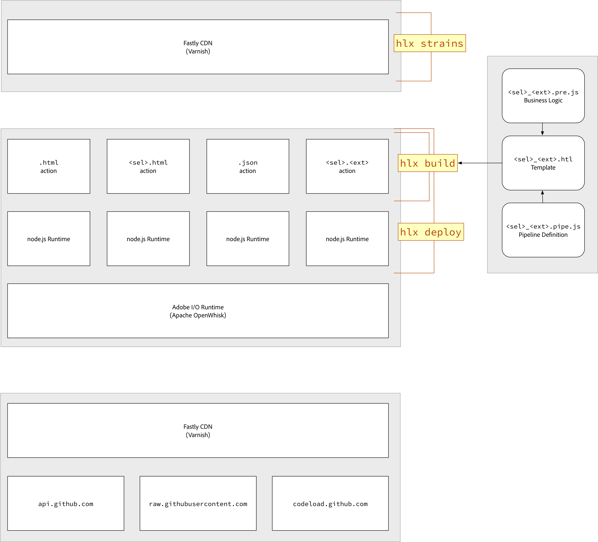
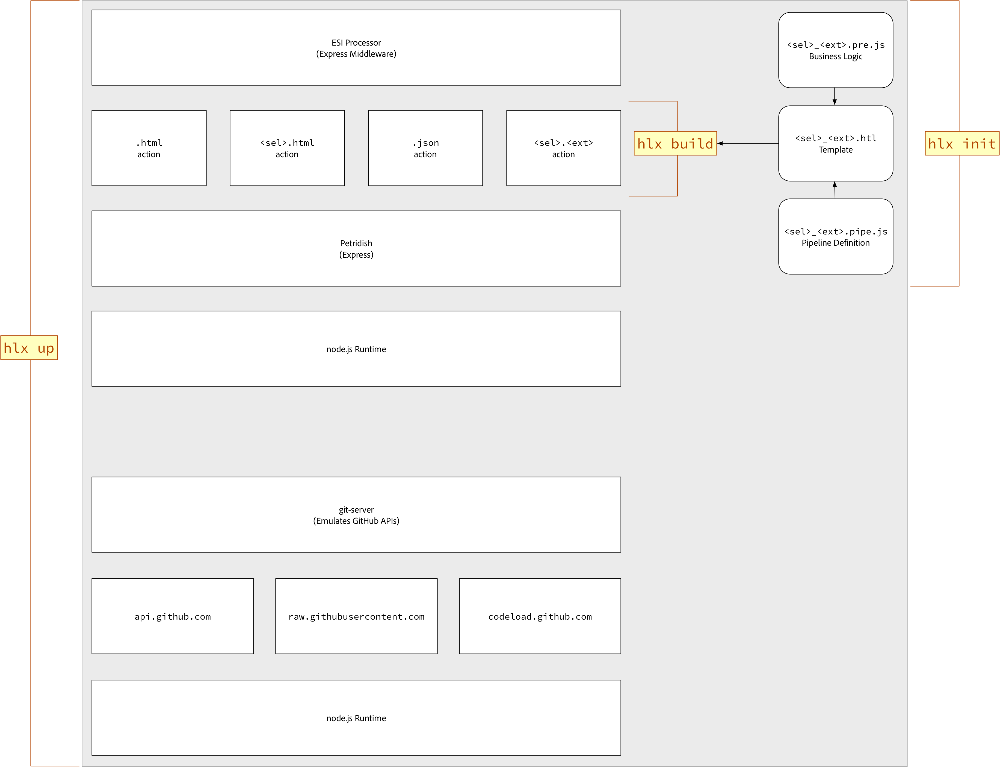

# Project Helix Architecture

> ~~Some people speculate that the primordial soup is where DNA first formed the double helix structure. But maybe it was just an incoherent soup of molecules.~~

> After the primordial soup, life has evolved in two powerful, intertwined flavors: development and production. This is their story

## Purpose

Project Helix is the next generation of digital experience management. In the current state it includes a serverless content delivery framework and developer tooling for local emulation.

## Project Helix in Action

We have deployed Helix on Adobe I/O Runtime and it can be used with a number of pre-configured example sites. A full list of example sites can be found in the [Helix CLI Integration Tests](https://github.com/adobe/helix-cli/tree/master/test/integration).

## Architecture

The production architecture consists of four main parts:

1. The Fastly CDN/edge computing platform
2. Customer-code on Adobe I/O Runtime
3. GitHub's content repositories and APIs (served by Fastly)
4. The Helix Command Line tool for code deployment

### Fastly Edge Computing

Fastly performs a number of key jobs for every request:

1. Request routing based on strain configuration
2. URL rewriting to invoke correct action on Adobe I/O Runtime
3. Processing of Edge-side includes
4. Efficient caching

#### Request Routing based on Strain Configuration

At the most basic level, a strain is a combination of content (specified as a git URL) and deployed code (specified as an OpenWhisk action name and namespace). As a given site may have multiple strains at the same time, the first job for every request is to identify the correct strain.

Fastly has access to two sources of information for that. On the one hand, strains can be enforced using the `X-Strain` HTTP header. To make it easier to set the header and to avoid switching between strains from request to request, Fastly also sets an `X-Strain` session cookie that is only valid for the current subdomain.

On the other hand, strains can be assigned based on conditions such as hostname, path, client IP address, or accept headers. These conditions are specified in a `.hlx/strains.yaml` file (example [here](https://github.com/adobe/helix-cli/blob/master/test/integration/.hlx/strains.yaml)). Conditions can be any valid VCL (Varnish Configuration Language) expression that evaluates to `true` or `false`.

When running `hlx strains`, the Helix Command Line will take each `condition` expression in the strain configuration and create a corresponding `strains.vcl` file which is deployed into Fastly and interpreted on a request-by-request basis.

#### URL Rewriting for Adobe I/O Runtime

The requests that are handled by Fastly have URLs like this `https://xdm.primordialsoup.life/README.html`. The corresponding URL on Adobe I/O Runtime would be `https://runtime.adobe.io//api/v1/web/trieloff/default/git-github-com-adobe-helix-cli-git--dirty--html?owner=adobe&repo=xdm&ref=master&path=/docs/reference/README.md&selector=&extension=html&branch=xdm&strain=xdm&GITHUB_KEY=HELLOWORLD`. 

> **Note**: You can make request using `curl` and set the `X-Debug` HTTP header to get additional debug output in the response headers, including `X-Backend-URL`.

To translate between the two URLs, Fastly loads a number of values from a number of [edge dictionaries](https://docs.fastly.com/guides/edge-dictionaries/about-edge-dictionaries.html), i.e. fast key-value stores that are available from VCL. The values for the dictionaries are set by the `hlx strains` command and include:

* `strain_action_roots`, i.e. the root for all deployed actions in Adobe I/O Runtime e.g. `trieloff/default/git-github-com-adobe-helix-cli-git--dirty--`
* `strain_owners`, i.e. the GitHub owner (or organization) for the content repository, e.g. `adobe`
* `strain_repos`, i.e. the name of the GitHub repo that stores the content, e.g. `xdm`
* `strain_refs`, i.e. the name of the branch, tag, or commit sha that identifies the content reference to be served. If no value can be found in the strain config, content will be served from `master`
* `strain_root_paths`, i.e. the base name that will be put in front of every path, e.g. `/docs/reference`

#### Processing of Edge Side Includes

One of the most powerful features of Fastly is the ability to process [Edge Side Includes](https://www.fastly.com/blog/using-esi-part-1-simple-edge-side-include). 

An ESI directive looks like this `<esi:include src="/NAV.nav.html" />` and will be replaced with the contents of `/NAV.nav.html`. When including, Fastly honors its own cache, so that includes are very fast and support granular invalidation.

Edge Side Includes can be used in a number of ways in Helix ranging from traditional to unconventional:

1. Include static resources like `/header.html` and `/footer.html` – this is how ESI is used in most traditional projects
2. Include dynamically rendered resources like a navigation using a custom selector like `/${path}/NAV.nav.html` – this is most similar to includes in Sling and other web frameworks with the added benefit of transparent caching and high performance
3. Use includes to dispatch to a different selector. When requesting `/${resource}.html`, the HTML content would be simply `<esi:include src="${resource}.${selector}.html" />`, i.e. a complete delegation to another selector (and as we will see, to another action)

#### Efficient Caching

Fastly and Varnish are most frequently used as caches, but that is only one application in Helix.

In order to make caching most efficient, our custom VCL ensures only following aspects are considered when generating a cache key:

* the URL
* the Strain

This normalization of the request ensures that many similar requests can simply be handled by the same strain.

We also normalize the response, by dropping all [unneccessary headers](https://www.fastly.com/blog/headers-we-dont-want) unless explicityly requested using `X-Debug`.

### Customer-code on Adobe I/O Runtime

Adobe I/O Runtime (based on Apache OpenWhisk) is where all customer code is running. A given customer project will be deployed as a number of OpenWhisk actions (serverless, stateless functions), varying on:

* git Remote URL of the project
* git ref (branch, tag, commit) that got deployed
* extension of the requested file, e.g. `html` for `README.html`
* selector and extension of the requested file, e.g. `nav_html` for `NAV.nav.html`

This means that a project may consist of hundreds of actions in parallel. Switching between functions is done through the strain configuration described above.

Theoretically, requests can be handled by any OpenWhisk Web action that is able to read the `repo`, `owner`, `ref`, and `path` parameters. Practically, nobody wants to write functions from scratch, so we provide a server(less)-side web development framework with [Hypermedia Pipeline](https://github.com/adobe/hypermedia-pipeline) (Name TBD).

Hypermedia Pipeline is a build-time framework (more like [StencilJS](https://stenciljs.com) than [Sling](https://sling.apache.org)) based on the idea that each action transforms a (JSON) request object into a (JSON) reponse object. An action is a simply a function (composed of smaller, single-purpose functions) that handles this transformation.

Hypermedia Pipeline provides developers with:

* a simple way of composing single-purpose functions (`pipe.pre()`, `pipe.once()`, and `pipe.post()`)
* a way of separating resource style (generated by templates) from resource logic (generated by `*.pre.js`)
* helper functions for many common hypermedia-related specifics like HTTP headers, fetching resources, Markdown, responsive HTML, etc.
* default pipelines for HTML and JSON (coming soon) that cover 95% of all use cases
* a simple way to define your own pipelines for the remaining 5% of use cases (`*.pipe.js`)

As a developer, you just `hlx build` your project using the [Helix Command Line Interface](https://github.com/adobe/helix-cli), which uses the [Parcel Bundler](https://parceljs.org) behind the scenes, which pulls in Helix-enabled Parcel plugins such as the [HTL/Sightly Parcel Plugin](https://github.com/adobe/parcel-plugin-htl) (it's the only working one right now), which uses [HTL Engine](https://github.com/adobe/htlengine) to compile your templates and [Hypermedia Pipeline](https://github.com/adobe/hypermedia-pipeline) to wrap them.

The Helix CLI also includes a `hlx deploy` command that handles the entire deployment to Adobe I/O Runtime, based on the OpenWhisk JavaScript client library.

All Adobe I/O Runtime actions run on a modified docker image that is a variation of the OpenWhisk node.js 8 image. Our docker image can be found in the directory `/prototypes/custom-docker` of this repository. It modifies the list of installed default dependencies, so that smaller deployments are possible.

### GitHub's content repositories and APIs

In Project Helix, GitHub serves as the content repository. Project Helix is using three different GitHub APIs:

1. `raw.githubusercontent.com` is used to retrieve markdown documents. This is an unofficial, not rate-limited API and the most important API for Project Helix
2. `codeload.github.com` is not used yet, but will be used for the retrieval of entire source repositories for the compiliation and bundling of client-side assets
3. `api.github.com` is used occasionally in customer code to get access to edit history of markdown documents.

## Architecture for Local Development

To allow frictionless local development, debugging etc. local development should be a first class citizen from the beginning. Even for product development.

The local development architecture is faithful to the production architecture in spirit, but not in bits. Instead of having to run a local version of OpenWhisk (and Docker, and, and, and) and Varnish, and GitHub (how?), developers get a clean lab environment that emulates the entire stack.

A development environment gets initialized by `hlx init`, which creates a new local git repository and NPM project with the correct dependencies. The rest of the development environment is brought up using `hlx up`.

`hlx up` does three things:

1. using `git-server`, it emulates the GitHub APIs
2. using `petridish`, it emulates the OpenWhisk node.js runtime
3. using `parcel watch`, it continously monitors source files and compiles them into JavaScript

### Local GitHub Emulation

Using [git-server](https://github.com/adobe/git-server), the git repository in the current working directory is served on `localhost` using APIs that are compatible to the GitHub API.

All components in higher layers of the stack can work as before, as long as they replace `raw.githubusercontent.com` with `localhost:port`, etc. When writing code, it is important to make all API hostnames configurable, which helps with local emulation, but also testing and mocking.

Git Server is implemented as a node.js/Express service.

### Local Runtime Emulation

The local runtime emulation is handled by another node.js/Express service, in this case by [petridish](https://github.com/adobe/petridish).

Petridish will

1. parse the request URL to determine extension and selector (like Fastly does in production)
2. invoke the `./hlx/build/<selector>_<extension>.js` file that corresponds to the selector and extension (like OpenWhisk does in production)
3. process edge side includes through an Express middleware (like Fastly does in production)

We try to make Petridish as faithful to the production implementation as possible, which also means we forgo the opportunity for some "intelligence" that would be hard to implement in production, even when the local implementation would be trivial.

## Helix Command Line

The [Helix Command Line](https://github.com/adobe/helix-cli) is the multitool for Helix development and deployment. It provides all functionality needed in the development lifecyle in one package that can be installed with one single command line invocation.

The functionality covered by `hlx` will include:

* project set-up
* local development
* unit and integration testing
* deployment
* performance testing

Like a real multitool, each component can be replaced by a more advanced power tool, but `hlx` should be the tool you have with you at any time and the most convenient way to get things done.

## Strains

A central concept in Project Helix is the concept of **Strains**. 
A **Strain** is the central abstraction of a variation of a website and consists of four main elements:

1. What content is the source of the strain (this includes Git owner, repo, branch, or ref)
2. What code is used to render the strain (this includes Git owner, repo, branch, or ref)
3. A random seed that is used for A/B testing and personalization
4. A series of conditions that are applied to a request to determine if a visitor is eligible to access a strain

### Usage Scenarios for Strains

#### Author/Publish

Author and Publish are simply two strains that use different content (different branches), the same code, the same random seed, and different conditions (Author requires a `author.*` subdomain)

In this scenario, strains are used to switch between content variants, keeping the code identical.

Sample:

| Author        | Publish           |
| ------------- | ----------------- |
| Content: https://github.com/Adobe-Marketing-Cloud/reactor-user-docs/tree/authoring      | Content: https://github.com/Adobe-Marketing-Cloud/reactor-user-docs/tree/master |
| Code: https://github.com/adobe/helix-helpx/tree/master      | Code: https://github.com/adobe/helix-helpx/tree/master      |
| Seed: 123 | Seed: 123 |
| Conditon: url starts with `author.` | Conditon: url starts with `publish.` |

#### Staging/Production

Staging and Production are simply two strains that use exactly the same content, and different code variants (typically from two branches of the same repository), the same random seed, and different conditions (Staging requires a `staging.*` subdomain)

Sample:

| Staging        | Production           |
| ------------- | ----------------- |
| Content: https://github.com/Adobe-Marketing-Cloud/reactor-user-docs/tree/master      | Content: https://github.com/Adobe-Marketing-Cloud/reactor-user-docs/tree/master |
| Code: https://github.com/adobe/helix-helpx/tree/staging      | Code: https://github.com/adobe/helix-helpx/tree/master      |
| Seed: 123 | Seed: 123 |
| Conditon: url starts with `staging.` | Conditon: url starts with `publish.` |

#### Feature Flags

The Staging/Production variant can also be used to enable feature flags. In this scenario, the feature flag branch is close to the production branch, but not identical, and implements slightly different features.

Sample:

| Production with new_cool_feature        |
| ------------- |
| Content: https://github.com/Adobe-Marketing-Cloud/reactor-user-docs/tree/master      |
| Code: https://github.com/adobe/helix-helpx/tree/new_cool_feature      |
| Seed: 456 |
| Conditon: url starts with `new_cool_feature.` AND seed equals to `456` |

#### Launches

Launches, i.e. larger adjustments of content structure and content of a site are closer to the Author/Publish set-up with the variation that each "launch" will be a branch that is close to, but not identical to the "authoring" branch. Once the launch is ready to go live, the branch will be merged into the "authoring" branch.

Sample:

| Authoring with new content        |
| ------------- |
| Content: https://github.com/Adobe-Marketing-Cloud/reactor-user-docs/tree/launch      |
| Code: https://github.com/adobe/helix-helpx/tree/master      |
| Seed: 789 |
| Conditon: url starts with `author.` AND seed equals to `789` |

### Managing Strains

In the beginning, each Strain will simply be a small configuration file that can be read by `petridish` or the `hlx` command line. Deployment of a strain will update a Fastly Edge dictionary so that the correct code and content URLs are being used and that the correct random seed will be pushed down.

In order to evaluate the strain's conditions we can either translate Strain conditions into VCL or interpret them in a custom OpenWhisk action (slower).

At a later point in time, it might be neccessary to keep a database of all deployed strains, so that the VCL can be re-generated at any time.

## Parameter Handling
